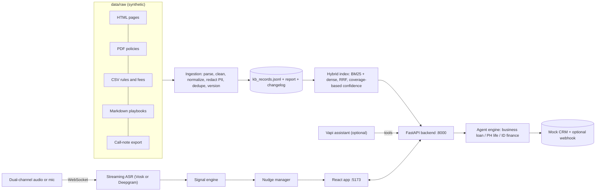

# Darwix AI Engineer Assessment — complete guide

This repository is a **working submission** for the Darwix AI Engineer assessment. It contains four related systems:

1. **Q1** — A voice agent that qualifies business-loan leads using a knowledge base (not memorized FAQs).
2. **Q2** — A knowledge base built from messy real-world-style documents (web pages, PDFs, tables, duplicates, PII).
3. **Q3** — Two **localized** voice bots (Philippines life insurance, Indonesia motor finance).
4. **Q4** — A **live call coach** that listens to agent + customer audio and shows short nudges on a dashboard.

You do **not** need prior experience with voice AI to run the demo locally. This document explains **what it is**, **how it works in plain language**, **how to install and use it**, and **what the assignment expects you to show**.

> **Important:** All companies, people, phone numbers, rates and policies in `data/raw/` are **synthetic demo data**, invented for this project. Do not treat anything as real financial or insurance advice. Do not commit API keys or `.env` files.

---

## Table of contents

1. [Big picture in five minutes](#big-picture-in-five-minutes)
2. [Assignment questions and what we built](#assignment-questions-and-what-we-built)
3. [Submission checklist (what graders look for)](#submission-checklist-what-graders-look-for)
4. [Measured results (honest summary)](#measured-results-honest-summary)
5. [How the system works](#how-the-system-works)
6. [Install and run (step by step)](#install-and-run-step-by-step)
7. [Using the web application](#using-the-web-application)
8. [Question-by-question usage guide](#question-by-question-usage-guide)
9. [Commands you will run often](#commands-you-will-run-often)
10. [Configuration and environment variables](#configuration-and-environment-variables)
11. [Hosted demo: Vapi, deploy, recordings](#hosted-demo-vapi-deploy-recordings)
12. [Repository layout](#repository-layout)
13. [Known limitations](#known-limitations)
14. [Security](#security)
15. [Where to read more](#where-to-read-more)

---

## Big picture in five minutes

Imagine three layers:

| Layer | Role | Analogy |
|---|---|---|
| **Sources** | HTML, PDF, CSV, notes in `data/raw/` | Filing cabinets full of policy PDFs and web pages |
| **Knowledge base (Q2)** | Cleaned, de-duplicated, PII-redacted records with citations | A librarian’s indexed catalog |
| **Applications** | Voice agents (Q1, Q3) and live nudges (Q4) that **search** that catalog | Staff who must quote the catalog, not guess |

**Voice agent (Q1 / Q3):** The bot follows a **script** (consent, questions, escalation rules). When the customer asks “What is the processing fee?” or objects to the rate, the bot **searches the knowledge base**, answers with **citations**, or **refuses** if nothing trustworthy was found.

**Knowledge base (Q2):** A Python pipeline reads every registered source file, removes boilerplate and duplicates, redacts PII, versions documents, and writes searchable records. Search is **hybrid** (keyword BM25 + embedding similarity), fused and scored so out-of-scope questions get **“insufficient evidence”** instead of hallucinations.

**Live nudges (Q4):** Recorded or live **two-channel** call audio (agent on one channel, customer on the other) is streamed in **real time** to speech recognition. A **signal engine** detects compliance risks, frustration, cross-sell moments, etc. A **nudge manager** filters noise (confidence, cooldowns, duplicates) and sends short cards to the browser dashboard.

Everything works **offline** without paid API keys: local embeddings, deterministic conversation logic, browser speech, and Vosk ASR. Optional keys turn on OpenAI, Deepgram, Vapi, and cloud hosting.

---

## Assignment questions and what we built

| # | Assignment theme | What you can try in the UI | Deep-dive doc | Evidence folder |
|---|---|---|---|---|
| **Q1** | Knowledge-grounded voice agent for one use case | **Voice Agent** tab → agent `business_loan` | [`docs/q1_voice_agent.md`](docs/q1_voice_agent.md) | [`evidence/q1/`](evidence/q1/) |
| **Q2** | Production-style KB from mixed sources | **Knowledge Base** tab | [`docs/q2_knowledge_base.md`](docs/q2_knowledge_base.md) | [`evidence/q2/`](evidence/q2/) |
| **Q3** | Native-language bots (PH + ID) | **Voice Agent** tab → `ph_life_insurance`, `id_consumer_finance` | [`docs/q3_localization.md`](docs/q3_localization.md) | [`evidence/q3/`](evidence/q3/) |
| **Q4** | Real-time insights and nudges | **Live Nudges** tab | [`docs/q4_realtime_nudges.md`](docs/q4_realtime_nudges.md) | [`evidence/q4/`](evidence/q4/) |

The line-by-line **requirement → implementation → status** matrix is in [`docs/assessment_report.md`](docs/assessment_report.md).

---

## Submission checklist (what graders look for)

Use this as your pre-submit checklist. Items marked **you** need a human recording, account, or deploy outside this repo.

### Repository package

| Requirement | Where it lives | Status |
|---|---|---|
| README with setup and architecture | This file + mermaid diagram below | Done |
| Environment template (no secrets) | [`.env.example`](.env.example) | Done |
| Architecture diagram | [Architecture](#architecture) section | Done |
| Sample inputs | [`data/raw/`](data/raw/) + [`data/raw/README.md`](data/raw/README.md) | Done |
| Automated test results | [`evidence/test_summary.md`](evidence/test_summary.md) | Done |
| Limitations + production plan | [`docs/production_improvements.md`](docs/production_improvements.md) | Done |
| No credentials in git | `.env` gitignored; secret scan clean | Done |
| Public GitHub link | — | **You:** push the repo |

### Q1 — Business-loan voice agent

| Requirement | How to demonstrate |
|---|---|
| One clear use case (business loan qualification) | Agent `business_loan`, fictional **Kosha Capital** |
| Script + business rules on a voice platform | [`configs/assistants/business_loan.json`](configs/assistants/business_loan.json); optional Vapi via [`backend/scripts/sync_vapi.py`](backend/scripts/sync_vapi.py) |
| Connected to Q2 KB (no FAQ text baked into the prompt) | Answers show `[kb_...]` citations; tools `kb_search` / `check_eligibility` |
| Flow: qualify, grounded objections, fallback, escalation | Scenarios in [`data/scenarios/agents/business_loan.json`](data/scenarios/agents/business_loan.json); transcripts in `evidence/q1/transcripts/` |
| Web or phone calling | Browser voice/text in UI; Vapi web call when configured |
| **At least 3 recorded test calls** | **You:** screen-record cooperative, objection, conflict/out-of-scope, etc. |
| Optional CRM / callback action | CRM panel in UI; `data/runtime/crm.jsonl` |

### Q2 — Knowledge base

| Requirement | How to demonstrate |
|---|---|
| Mixed inputs (web, PDF, forms, tables, duplicates, PII, bad PDF) | Ingestion report in UI or `data/processed/ingestion_report.json` |
| Cleaning, normalization, dedup, versioning | Run pipeline; read [`docs/q2_knowledge_base.md`](docs/q2_knowledge_base.md) |
| Schema, metadata, citations | Search in **Knowledge Base** tab; see citation format on answers |
| Retrieval evaluation (≥5 labelled queries; we have 18) | [`evidence/q2/retrieval_report.md`](evidence/q2/retrieval_report.md) |
| Hooked to voice bot or search UI | Agents + **Knowledge Base** tab |

### Q3 — Philippines and Indonesia bots

| Requirement | How to demonstrate |
|---|---|
| PH: life / bancassurance; EN + Tagalog / Taglish | Agent `ph_life_insurance` |
| ID: multifinance; formal + colloquial + regional markers | Agent `id_consumer_finance` |
| Market terminology, politeness, dates, amounts | See [`docs/q3_localization.md`](docs/q3_localization.md) (3 examples per market) |
| ASR/TTS choices documented | Q3 doc; Vapi uses Deepgram + Azure neural voices when deployed |
| Fallback and escalation in customer language | Scenarios q3_ph_03, q3_id_* in `evidence/q3/` |
| **Two recorded calls per market** | **You:** native speakers recommended; measure WER with [`backend/scripts/wer.py`](backend/scripts/wer.py) |

### Q4 — Live nudges

| Requirement | How to demonstrate |
|---|---|
| Streaming audio at real-time speed (or live mic) | **Live Nudges** → replay or mic |
| Separated agent/customer ASR | Dual-channel replay; per-speaker transcript columns |
| Signal types: compliance, frustration, cross-sell, callback, etc. | Replay `rt_compliance`, `rt_cross_sell`; read [`configs/nudges/rules.json`](configs/nudges/rules.json) |
| Dashboard nudges + controls (dedupe, cooldown, TTL) | Suppressed log + expiry countdown on cards |
| Latency P50/P95, component breakdown | [`evidence/q4/latency_report.md`](evidence/q4/latency_report.md) |
| False-positive / missed-opportunity discussion | Q4 doc section 6; noisy call scenario |
| **Screen recording of live demo** | **You:** record dashboard during replay |

### Google Form (typical fields)

Prepare before submitting:

- **Name, contact, email**
- **Resume link**
- **Repository URL** (after you push to GitHub)
- **Submission file** (zip or link to repo — follow the form’s instructions)
- **Link** to deployed app and/or **walkthrough video** (10–15 minutes; outline below)

---

## Measured results (honest summary)

These numbers were generated on this codebase; re-run the commands in [Commands](#commands-you-will-run-often) to refresh them.

| Area | Result | Source |
|---|---|---|
| Unit + scenario tests | **45 / 45** pass | `python -m pytest tests -q` |
| Q1 scripted conversations | **6 / 6** pass | [`evidence/q1/scenario_results.md`](evidence/q1/scenario_results.md) |
| Q3 scripted conversations | **8 / 8** pass (3 PH, 5 ID) | [`evidence/q3/scenario_results.md`](evidence/q3/scenario_results.md) |
| Q2 retrieval | **17** correct, **1** partial, **0** wrong; **3 / 3** refusals | [`evidence/q2/retrieval_report.md`](evidence/q2/retrieval_report.md) |
| Q4 nudges (15 replay runs) | **0** false positives; required signal kinds **100%** | [`evidence/q4/latency_report.md`](evidence/q4/latency_report.md) |
| Q4 end-to-end latency | P50 **~2.08 s**, P95 **~3.22 s** (trigger word → dashboard); mostly ASR delay | same |
| Live API smoke test | **8 / 8** | `python backend/scripts/smoke_test.py` |
| Q4 ASR word error rate | ~4–18% clean calls; up to ~47% on very noisy customer channel | [`evidence/q4/asr_wer.md`](evidence/q4/asr_wer.md) |

**Not claimed without your recordings:** native-speaker accent robustness (Q3), production phone quality, or policy accuracy beyond the synthetic corpus and these tests.

---

## How the system works

### Architecture



### Glossary (zero prior knowledge)

| Term | Meaning here |
|---|---|
| **ASR** | Automatic speech recognition — audio → text |
| **TTS** | Text-to-speech — bot speaks aloud |
| **KB** | Knowledge base — searchable records built from `data/raw/` |
| **Grounding** | Answering only from retrieved KB text + citations |
| **Slot** | A field the bot must collect (e.g. loan amount, payment date) |
| **Vapi** | Third-party hosted voice platform (optional); our backend exposes tools it calls |
| **WebSocket** | Live channel used for streaming audio and nudge events (Q4) |
| **BM25 / dense / RRF** | Keyword search + embedding search + merge strategy for retrieval |
| **Nudge** | A short coach hint shown to a human supervisor during a call |

### Offline vs with API keys

| Concern | Default (no keys) | With keys |
|---|---|---|
| Embeddings | Local hashed n-grams | OpenAI `text-embedding-3-small` |
| Vector store | In-memory numpy | Qdrant (`QDRANT_URL`) |
| Answer wording | Extractive from KB hits | Optional GPT paraphrase constrained to hits |
| Agent conversation | Deterministic engine | Same engine locally; Vapi uses GPT + our tools |
| Voice (Q1/Q3) | Browser Web Speech API | Vapi: Deepgram Nova-3 + Azure/ElevenLabs voices |
| Real-time ASR (Q4) | Vosk (English small model) | Deepgram Nova-3 multichannel |
| Nudge “AI judge” | Rules + lexicons only | Optional GPT classifier for ambiguous lines |

Copy [`.env.example`](.env.example) to `.env` and fill keys only when you need hosted voice or cloud ASR.

---

## Install and run (step by step)

### Prerequisites

- **Python 3.12+** (3.13 tested on Windows)
- **Node.js 20+** (for the frontend)
- **Git** (to clone and submit)
- **~500 MB disk** if you download the Vosk model (Q4 offline ASR)

### 1. Clone and create a virtual environment

```bash
cd Darwix-Assignment
python -m venv .venv
```

**Windows (PowerShell):**

```powershell
.\.venv\Scripts\Activate.ps1
pip install -r backend/requirements.txt
```

**macOS / Linux:**

```bash
source .venv/bin/activate
pip install -r backend/requirements.txt
```

### 2. Environment file

```bash
cp .env.example .env
```

Leave keys empty for a fully local demo. Never commit `.env`.

### 3. Build the knowledge base (required once, and after changing `data/raw/`)

```bash
cd backend
python scripts/make_sample_pdfs.py
python -m app.ingestion.pipeline
```

Outputs:

- `data/processed/kb_records.jsonl` — searchable records
- `data/processed/ingestion_report.json` — PII, duplicates, failed PDF, etc.
- `data/processed/kb_changelog.json` — version diff

### 4. Start the backend API

From `backend/` (venv active):

```bash
uvicorn app.main:app --host 0.0.0.0 --port 8000
```

- API: http://localhost:8000  
- Interactive API docs: http://localhost:8000/docs  

### 5. Start the frontend (second terminal)

```bash
cd frontend
npm install
npm run dev
```

Open http://localhost:5173 — you should see three tabs and green badges when the backend is up.

### 6. Optional: Vosk model for Q4 offline replay

Download [vosk-model-small-en-us-0.15](https://alphacephei.com/vosk/models/vosk-model-small-en-us-0.15.zip) (~40 MB), unzip to:

`models/vosk-model-small-en-us-0.15`

Or set `ASR_PROVIDER=deepgram` and `DEEPGRAM_API_KEY` in `.env`.

### 7. Optional: Docker (backend + frontend)

From repository root:

```bash
docker compose up --build
```

The backend image builds the KB and can download Vosk at build time (`WITH_VOSK=1`).

### Troubleshooting

| Problem | Fix |
|---|---|
| UI says “Backend unreachable” | Start uvicorn in `backend/` on port 8000 |
| Q4 replay has no transcript | Install Vosk model or switch ASR to Deepgram |
| `generate_call_audio.py` fails | Script uses **Windows SAPI** voices; on Linux/macOS use committed audio under `data/audio/realtime/` or run once on Windows |
| Browser voice mode silent | Use **Chrome or Edge**; allow microphone; try **Text** mode first |
| Permission errors on `.venv` | Recreate venv with `python -m venv .venv` |

---

## Using the web application

The app has **three tabs** (see [`frontend/src/App.tsx`](frontend/src/App.tsx)).

### Voice Agent (Q1 / Q3)

1. Choose **agent**: `business_loan` (Q1), `ph_life_insurance` (PH), or `id_consumer_finance` (ID).
2. Choose **mode**:
   - **Text** — type customer lines (easiest for first test).
   - **Browser voice** — Web Speech ASR/TTS (Chrome/Edge).
   - **Vapi web call** — only if `VAPI_PUBLIC_KEY` and assistant IDs are set.
3. Pick **opening language** where applicable (English / Taglish / Indonesian).
4. Click **Start call**, then speak or type as the **customer**.
5. Watch the **state panel** (stage, language, slots) and **CRM panel** (actions written).
6. **Export transcript** — includes KB citations for grounded answers.

**Tip for assessors:** Scripted turns live in [`data/scenarios/agents/`](data/scenarios/agents/). Example Q1 opening: consent → years in business → turnover → amount → purpose → CIBIL → default history → registration → callback time.

### Knowledge Base (Q2)

1. Enter a natural-language **question** (e.g. “Can I prepay my business loan?”).
2. Filter by **market** (`in`, `ph`, `id`) or leave global.
3. Toggle **include superseded** to see old FAQ versions.
4. Read the **answer** or **refusal** banner, **citations**, and **hit list** with scores.
5. Scroll to **Ingestion report** for PII counts, duplicates removed, and source errors.

This is the same index the voice agents query internally.

### Live Nudges (Q4)

1. Choose **mode**:
   - **Replay** — plays a scripted dual-channel WAV at 1× speed (best for demos).
   - **Mic** — your microphone as customer channel (agent channel silent unless you customize).
   - **Browser ASR** — sends browser transcripts instead of raw audio.
2. Select a **scenario** (e.g. `rt_compliance`, `rt_cross_sell`, `rt_noisy`).
3. Click **Start session** — audio plays in sync with transcripts and nudges.
4. Observe **nudge cards** (TTL countdown), **suppressed candidates** (why something was blocked), **topics**, and **latency table** (P50/P95 per stage).

**Demo script for assignment:** Show compliance nudges on `rt_compliance`, cross-sell on `rt_cross_sell`, then `rt_noisy` where ASR is poor and most nudges correctly stay off.

---

## Question-by-question usage guide

### Q1 — Business loan agent

**Goal:** Qualify an MSME lead without inventing rates or policy text.

**Try in UI:** Agent `business_loan`, text mode, scenario [`q1_02_objection_rate`](data/scenarios/agents/business_loan.json) — ask about interest rate; reply should cite KB and return to slot collection.

**Automated proof:** `cd backend && python scripts/run_agent_scenarios.py` → updates `evidence/q1/`.

**Voice platform:** [`docs/q1_voice_agent.md`](docs/q1_voice_agent.md) — flow diagram, slots, eligibility rules from CSV records, escalation rules.

### Q2 — Knowledge base

**Goal:** Show you can turn messy sources into a governed, searchable KB.

**Try in UI:** Search “foreclosure charge”, then an out-of-scope question (e.g. unrelated product) to see refusal.

**Rebuild KB:** `python -m app.ingestion.pipeline`

**Evaluate retrieval:** `python scripts/eval_retrieval.py` → `evidence/q2/retrieval_report.md`

**Design details:** parsing per format, dedup threshold 0.80 Jaccard on shingles, hybrid retrieval, confidence threshold 0.40 — [`docs/q2_knowledge_base.md`](docs/q2_knowledge_base.md).

### Q3 — Localized bots

**Philippines (`ph_life_insurance`):** Taglish lead qual; HMO vs life objection; PHP amounts; escalation stays in customer language.

**Indonesia (`id_consumer_finance`):** Payment reminder; formal vs colloquial; hardship → soft ask, no pressure; “already paid” → verification channel question.

**Try in UI:** Text mode with lines from [`evidence/q3/transcripts/`](evidence/q3/transcripts/).

**Accent / WER:** Not fully measured in repo — record calls, hand-correct one transcript per market, run:

```bash
cd backend
python scripts/wer.py --ref corrected.txt --hyp asr.txt
```

### Q4 — Real-time nudges

**Goal:** Supervisor sees timely, actionable hints without spam.

**Pipeline:** Audio chunk (100 ms) → ASR per channel → signals in [`backend/app/realtime/signals.py`](backend/app/realtime/signals.py) → gates in [`backend/app/realtime/nudges.py`](backend/app/realtime/nudges.py) → WebSocket → dashboard.

**Regenerate metrics:**

```bash
cd backend
python scripts/generate_call_audio.py          # Windows SAPI; or use existing WAVs
python scripts/run_realtime_eval.py --rounds 3
python scripts/wer.py
```

**Read:** [`docs/q4_realtime_nudges.md`](docs/q4_realtime_nudges.md) for signal table, partial-trigger rules, and latency definition (from **trigger word in audio**, not from when ASR finishes — honest but higher numbers).

---

## Commands you will run often

Run from **`backend/`** with venv active unless noted.

| Purpose | Command |
|---|---|
| Build / refresh KB | `python -m app.ingestion.pipeline` |
| Q2 retrieval metrics | `python scripts/eval_retrieval.py` |
| Q1 + Q3 conversation tests | `python scripts/run_agent_scenarios.py` |
| Q4 generate audio (Windows) | `python scripts/generate_call_audio.py` |
| Q4 latency + nudge eval | `python scripts/run_realtime_eval.py --rounds 3` |
| Q4 ASR WER | `python scripts/wer.py` |
| Live API smoke test (backend running) | `python scripts/smoke_test.py` |
| All unit tests (from repo root) | `python -m pytest tests -q` |
| Frontend production build | `cd frontend && npm run build` |
| Sync Vapi assistants (dry run) | `python scripts/sync_vapi.py` |
| Apply Vapi changes | `python scripts/sync_vapi.py --apply` |

Full test narrative: [`evidence/test_summary.md`](evidence/test_summary.md).

---

## Configuration and environment variables

See [`.env.example`](.env.example). Highlights:

| Variable | Purpose |
|---|---|
| `PUBLIC_BASE_URL` | Public HTTPS URL of backend (Vapi webhooks) |
| `WEBHOOK_SECRET` | Validates `X-Vapi-Secret` on Vapi callbacks |
| `CORS_ORIGINS` | Frontend origin(s), e.g. `http://localhost:5173` |
| `EMBEDDING_PROVIDER` | `local` (default) or `openai` |
| `RETRIEVAL_MIN_SCORE` | Refusal threshold (default 0.40) |
| `VAPI_API_KEY` / `VAPI_PUBLIC_KEY` | Vapi private (sync script) and public (browser SDK) |
| `VAPI_ASSISTANT_*` | Assistant IDs after sync |
| `ASR_PROVIDER` | `vosk` or `deepgram` |
| `VOSK_MODEL_PATH` | Path to unzipped Vosk model |
| `OPENAI_API_KEY` | Optional LLM paraphrase and nudge classifier |

The UI header badges (`LLM`, `Embeddings`, `ASR`, `Vapi`) reflect live config from `GET /api/config`.

---

## Hosted demo: Vapi, deploy, recordings

### Accounts (optional for local; needed for public voice demo)

| Service | Purpose | Notes |
|---|---|---|
| [Vapi](https://vapi.ai) | Hosted web/phone calls, recordings | Trial credit |
| [OpenAI](https://platform.openai.com) | Vapi LLM; optional features | Pay as you go |
| [Deepgram](https://deepgram.com) | Optional Q4 streaming ASR | Free credits |
| [Railway](https://railway.app) or [Render](https://render.com) | Backend HTTPS | Hobby tier |
| [Vercel](https://vercel.com) | Frontend static host | Free tier |

### Connect Vapi (summary)

1. Deploy backend or expose with ngrok; set `PUBLIC_BASE_URL` and `WEBHOOK_SECRET`.
2. Set `VAPI_API_KEY`; run `python backend/scripts/sync_vapi.py`, then `--apply`.
3. Copy printed assistant IDs and `VAPI_PUBLIC_KEY` into `.env`; restart backend.
4. In UI, use **Vapi web call** mode. Tools hit `/api/vapi/tools` (`kb_search`, `check_eligibility`, `schedule_callback`, `transfer_to_human`, `record_promise_to_pay`).

### Deploy

- **Backend:** Build [`backend/Dockerfile`](backend/Dockerfile) with **repository root** as context. Set env vars from `.env.example`. Listens on `$PORT`.
- **Frontend:** Vercel — root `frontend`, build `npm run build`, output `dist`, env `VITE_API_BASE=https://your-backend`. Add Vercel URL to backend `CORS_ORIGINS`.

### Recordings and walkthrough video (**you**)

1. **Q1:** ≥3 voice calls (cooperative, objection, conflict/out-of-scope/human) — save under `evidence/q1/recordings/`.
2. **Q3:** ≥2 calls per market; note speaker region for ID accent test; WER with `wer.py`.
3. **Q4:** Screen-record **Live Nudges** replay with synced audio.
4. **Video (~10–15 min):** architecture → Q2 ingestion + search → Q1 live call + CRM → Q3 two markets → Q4 dashboard + noisy call → limitations ([`docs/production_improvements.md`](docs/production_improvements.md)).

---

## Repository layout

```
backend/app/ingestion   # Q2: parsers, PII, dedup, pipeline
backend/app/retrieval   # Q2: hybrid search, answers, refusals
backend/app/agents      # Q1 + Q3: conversation engine and agents
backend/app/realtime    # Q4: ASR, signals, nudges, WebSocket session
backend/app/api         # REST, Vapi webhooks, WebSocket routes
backend/scripts         # eval, audio, smoke_test, sync_vapi, wer
configs/assistants      # Agent scripts + Vapi JSON
configs/nudges          # Q4 rules and thresholds
data/raw                # Synthetic sources + sources.json registry
data/scenarios          # Agent + realtime test scripts
data/eval               # Labelled retrieval queries
data/processed          # Generated KB (after pipeline)
data/audio/realtime     # Dual-channel test calls
evidence                # Reports, transcripts, Q4 logs (for submission)
frontend                # React UI (three tabs)
tests                   # pytest (45 tests)
docs                    # Deep dives + assessment_report + production plan
```

---

## Known limitations

Be explicit in demos and in the form submission:

- **Synthetic data only** — not validated by compliance or native speakers in production.
- **Q3 regional Indonesian** — lexical normalization (Javanese/Sundanese/Betawi markers), not acoustic accent training; WER/accent metrics need your recordings.
- **Q4 English Vosk** on PH/ID calls — demo uses English scripted calls; multilingual production needs Deepgram or per-market models.
- **Latency ~2 s P50** — dominated by partial ASR emission, not Python logic; see Q4 doc.
- **Noisy call** — high WER can **miss** a legitimate callback nudge; documented in Q4 evidence.
- **Frontend** — builds cleanly; browser UI was not exhaustively manually tested on every OS.

Production roadmap: [`docs/production_improvements.md`](docs/production_improvements.md).

---

## Security

- Do **not** commit `.env`, API keys, or real customer data.
- PII is redacted **before** KB storage; runtime logs redact unanswered customer questions.
- Vapi webhooks check `X-Vapi-Secret` when `WEBHOOK_SECRET` is set.
- Only [`.env.example`](.env.example) with empty placeholders belongs in git.

---

## Where to read more

| Document | Contents |
|---|---|
| [`docs/assessment_report.md`](docs/assessment_report.md) | Full requirement matrix and status |
| [`docs/q1_voice_agent.md`](docs/q1_voice_agent.md) | Flow, slots, eligibility, test calls |
| [`docs/q2_knowledge_base.md`](docs/q2_knowledge_base.md) | Ingestion, schema, retrieval, citations |
| [`docs/q3_localization.md`](docs/q3_localization.md) | PH/ID design, ASR/TTS, examples, gaps |
| [`docs/q4_realtime_nudges.md`](docs/q4_realtime_nudges.md) | Signals, controls, latency, FP analysis |
| [`docs/production_improvements.md`](docs/production_improvements.md) | Scale, monitoring, model upgrades |
| [`evidence/test_summary.md`](evidence/test_summary.md) | All automated test commands and results |
| [`data/raw/README.md`](data/raw/README.md) | Corpus map and intentional defects |

---

*Darwix AI Engineer Assessment implementation — deterministic, KB-grounded, and measured where the brief requires evidence.*
