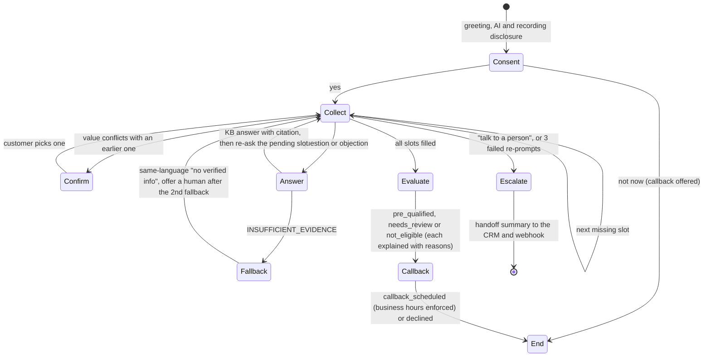

# Q1: Knowledge-grounded business-loan voice agent

Use case: **business-loan qualification** for Kosha Capital, a fictional NBFC, calling an MSME owner who left an
enquiry. The script, slots, lines and Vapi definition are in
[`configs/assistants/business_loan.json`](../configs/assistants/business_loan.json). The code is in
[`backend/app/agents/engine.py`](../backend/app/agents/engine.py) and
[`backend/app/agents/business_loan.py`](../backend/app/agents/business_loan.py).

## Two ways to call it

| | Web call (works offline) | Vapi assistant (hosted) |
|---|---|---|
| How | *Voice Agent* tab: browser speech recognition and synthesis, turns sent to `/api/agent/session/{id}/message` | `sync_vapi.py` creates the assistant; the web UI starts a Vapi web call, or attach a phone number in Vapi |
| Conversation control | Deterministic engine (slot filling, conflict handling, intents) | GPT-4o-mini following the system prompt, with tool calls |
| Knowledge | `kb_search` from the Q2 index, inside the engine | `kb_search` tool, answered by the same Q2 index (a Vapi custom-knowledge-base endpoint, `/api/vapi/kb`, is also implemented as an alternative) |
| Eligibility | `evaluate_eligibility()` on KB rule records | `check_eligibility` tool, the same function |
| Actions | Mock CRM (`data/runtime/crm.jsonl`), optional `ESCALATION_WEBHOOK_URL` | `schedule_callback`, `transfer_to_human` tools, end-of-call report stored with the recording URL |

Both paths share the knowledge base, rules and actions. The system prompt contains the flow and safety rules only; no
FAQ, objection, rate or fee text. Product facts come from KB retrieval at runtime, so editing a source document and
rebuilding changes the answers.

## Conversation flow

- **Slots:** consent, years in business, annual turnover, loan amount, purpose, approximate CIBIL score, 90-day
  default in the last 12 months, business registration, then callback and callback time.
- **Several details in one turn:** answers are split into clauses, so "turnover is about 3 lakh a month and I need
  around 15 lakh" fills both turnover (annualized to 36 lakh, read back) and amount.
- **Units and formats:** lakh and crore, "since 2019" for years in business, "tomorrow at 11 am" for callback times.
- **Conflicts:** a new value for a filled slot is not silently overwritten. The bot reads both values back and asks
  which is correct.
- **Unknown values:** "I don't know my score" is accepted. The rule is marked unverified, and the result becomes
  `needs_review` rather than a pass.

## Qualification logic

The rules are KB records from `eligibility_rules.csv` (BL-ELIG-01 to 07, for example vintage of at least 2 years,
turnover of at least ₹12 lakh, CIBIL of at least 700, amount between ₹1 lakh and ₹50 lakh, no recent default,
registered business). Age is checked later from KYC documents. Excluded purposes (speculative real estate, trading,
crypto, gambling, credit-card debt) are matched by the purpose slot's patterns in the agent config. They mirror the
KB's "Uses of the Loan" record but are duplicated there. Deriving them from the KB would remove that duplication.

The result is `pre_qualified`, `needs_review` or `not_eligible`, with the failed and unverified rule IDs, and the KB
version the rules came from. The bot always states that this is a preliminary check, not an approval, and never quotes
a final rate or promises approval.

## Grounding, fallback and escalation

- Questions and objections are answered only from KB hits above the confidence threshold, with record citations in the
  transcript.
- Below the threshold, the bot says "I don't have verified information about that in our approved material, so I won't
  guess", offers a relationship manager, and returns to the pending question.
- Escalation happens on an explicit request, or after 3 consecutive turns the bot couldn't understand. It writes a
  handoff summary (slots so far, unanswered questions with PII redacted) so the customer doesn't repeat themselves.
- PAN, Aadhaar and bank details are never requested on the call.

## Test calls

| Scenario | Coverage | Result |
|---|---|---|
| [q1_01_cooperative](../evidence/q1/transcripts/q1_01_cooperative.md) | Cooperative; multi-slot answer, monthly turnover annualized; callback scheduled | pre_qualified |
| [q1_02_objection](../evidence/q1/transcripts/q1_02_objection.md) | Objections: rate too high, hidden charges, document privacy, needs time; all KB-cited | pre_qualified |
| [q1_03_incomplete_conflicting](../evidence/q1/transcripts/q1_03_incomplete_conflicting.md) | Conflicting vintage (5 years, then 1), unknown credit score, unclear answer re-prompted | not_eligible (BL-ELIG-01), score unverified |
| [q1_04_out_of_scope](../evidence/q1/transcripts/q1_04_out_of_scope.md) | Home loans and the gold rate refused without guessing; in-scope prepayment question answered | fallback, then human offered |
| [q1_05_human_request](../evidence/q1/transcripts/q1_05_human_request.md) | "Can I just speak to a real person?" mid-flow | escalated with summary |
| [q1_06_excluded_purpose](../evidence/q1/transcripts/q1_06_excluded_purpose.md) | Loan for stock-market trading | not_eligible (excluded purpose) |

These are text-level runs through the production engine (`python backend/scripts/run_agent_scenarios.py`). Voice
recordings are made from the web UI or the Vapi assistant with the same scripts. Use *Export transcript* in the UI, and
the Vapi end-of-call report stores the recording URL under `evidence/vapi_calls/`.

## Known limitations

- The deterministic NLU is robust for the tested phrasings, but it is a rule system. Unusual phrasing gets a re-prompt,
  and escalation after 3. The Vapi path uses an LLM for understanding, at the cost of less predictable flow control.
- Browser speech recognition quality depends on the browser (Chrome or Edge recommended), and it doesn't support
  barge-in. The bot finishes speaking before it listens.
- Callback scheduling writes to a mock CRM. A real deployment would call the CRM or calendar API with idempotency keys.
